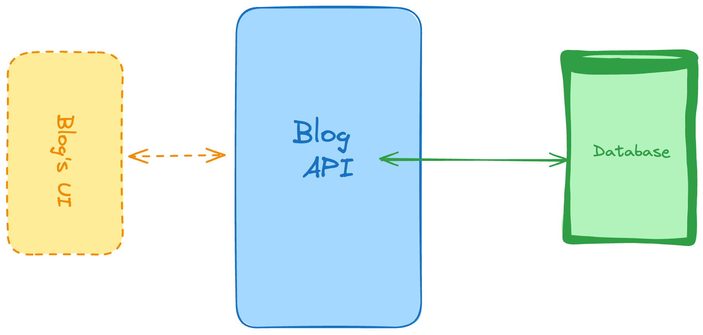

## Personal Blogging Platform API

Habilidades y tecnologías utilizadas : CRUD para operaciones principales, bases de datos (SQL o NoSQL), API RESTful del lado del servidor.

Comencemos con uno muy común cuando se trata de proyectos backend.
Esta es una API RESTful que impulsaría un blog personal. Esto implica que tendría que crear una API de backend con las siguientes responsabilidades:
* Devuelve una lista de artículos. Puedes agregar filtros como fecha de publicación o etiquetas.
* Devuelve un solo artículo, especificado por el ID del artículo.
* Crear un nuevo artículo para ser publicado.
* Eliminar un solo artículo, especificado por el ID.
* Para actualizar un solo artículo, nuevamente deberá especificar el artículo usando su ID.
Y con esos puntos finales has cubierto las operaciones CRUD básicas ( Crear , Leer , Actualizar y Eliminar ).
Como recomendación para Techstack, puedes usar Fastify como el marco principal de backend si vas a usar Node, o quizás Django para Python o incluso Ruby on Rails o Sinatra para Ruby. En cuanto a tu base de datos, puedes usar MongoDB si quieres probar NoSQL o MySQL si quieres comenzar con bases de datos relacionales primero.